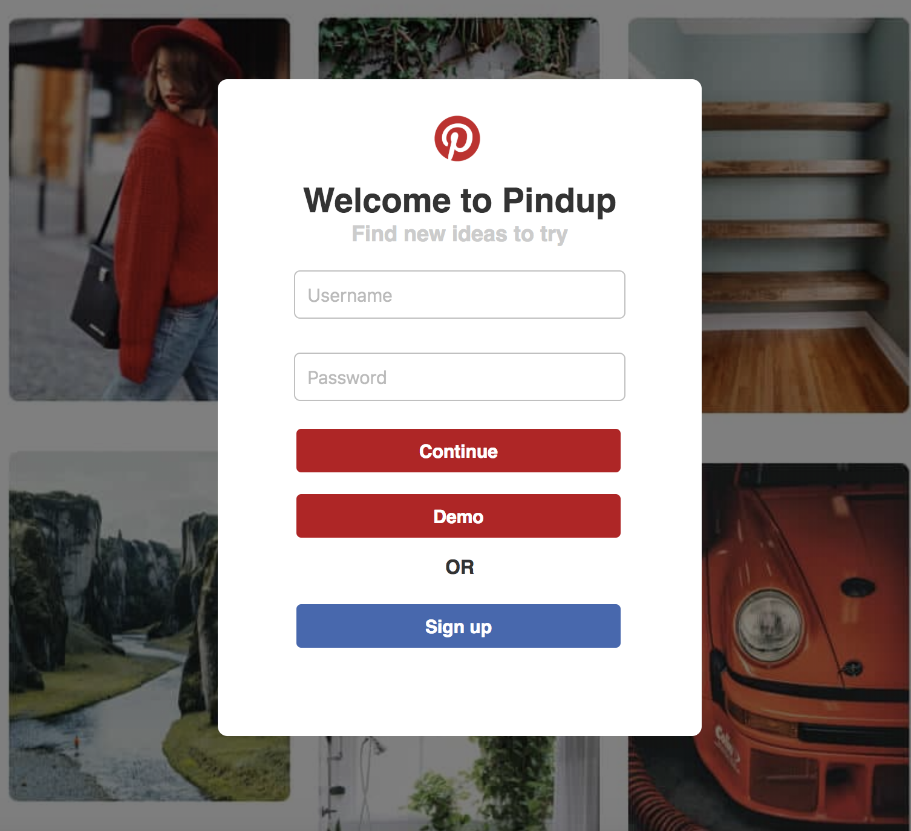
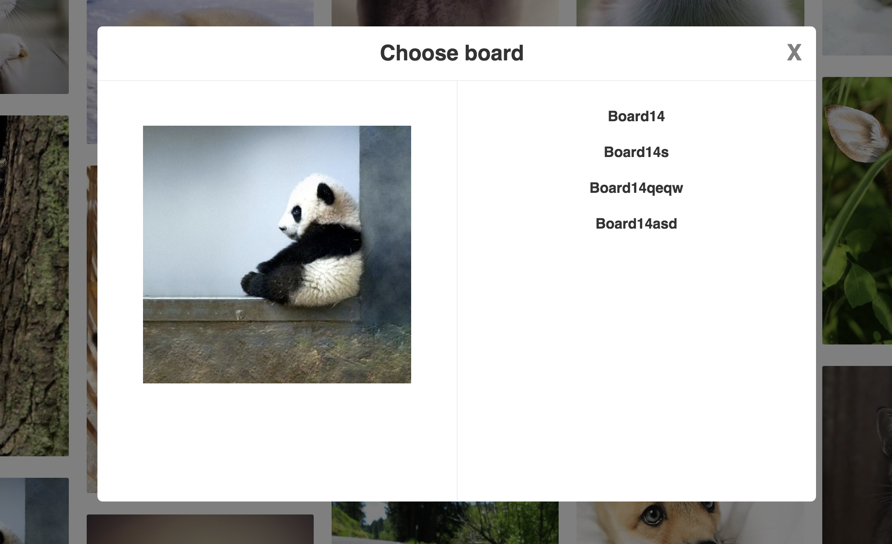
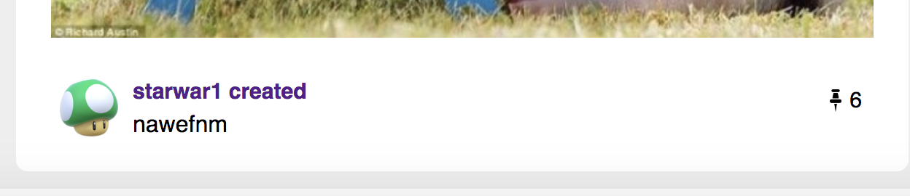
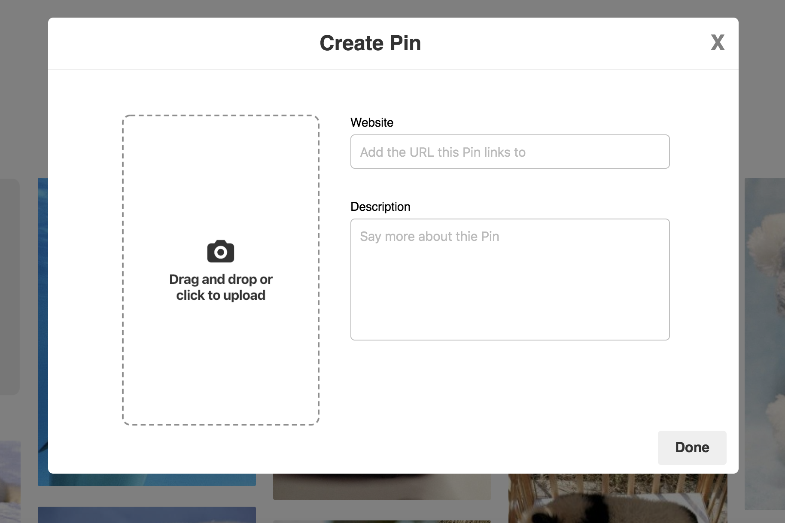

# Pindup
[Live site](https://pindub.herokuapp.com/#/)

Pindup is a web application for the photo lovers, inspired by Pinterest. Users can find pictures they like in the feed page or from other users' pin boards. Users can also save or upload the pictures they like to the board they have created.

## Technologies

Pindup is made with rails in the backend and react/redux for the frontend. The data is housed in a Postgresl Sql database.

## Key Features

* Profiles
  * Users can view the boards and pins in their profile page. Users can also have the access to other users' profile page after they logged in.
  * The profile page display all the information belongs to the user. User can also find all the pins they have pinned and uploaded.
  * User can create boards and pins in their own profile page.
* Search
  * User can search pins in the feed page by the description of pins.
* Modal
  * Modal is used for Log In/Sign Up page and the form page in this application.
* Feed
  * The feed page would render all the Pins from the database randomly.
  * The feed page uses the image grid css style.
  * User can save Pins from the feed page.
* Likes
  * Users will increment the likes for the Pin after they save it to their own board.

## Technical Implementation

### User Authentication

<center>

</center>

### Modals

Every form in Pindup is displayed by the modal. Including session form, pin/board create form, pin/board edit form, pin save form.

Because we do not want to see the session form after user logged in. I used modal component to handle the form before logged in. And the new modal component to handle the after logged in modals.

For both of them, I use switch to handle which form to display.



```javascript
  function Modal({modal, closeModal, loggedIn}) {
    if (loggedIn) {
      return null;
    }
    let component;
    switch (modal) {
      case 'login':
      component = <LoginFormContainer />;
        break;
      case 'signup':
      component = <SignupFormContainer />;
        break;
      default:
        component = <LoginFormContainer />;
        break;
    }

```

```javascript
const Modal = (props) => {
  if (!props.modal){
    return null;
  }
  let component;
  switch(props.modal.modal){
    case "CreateBoard":
    component = <BoardCreateContainer />;
    break;
    case "EditBoard":
    component = <BoardEditContainer board={props.modal.board}/>;
    break;
    case "CreatePin":
    component = <PinCreateImg />;
    break;
    case "PinChooseboard":
    component = <PinChooseboard pin={props.modal.pin}/>;
    break;
    default:
    return null;
  }
```

### Likes

When user pinned picture belongs to other user, it will increment the likes of the pin. I handle the problem in the backend by creating new Pinboard object in the join table.



```ruby
def create
  if pin_params[:author_id]
    Pinboard.create!({pin_id: params[:pin][:id], board_id: params[:boardId]})
    render :show
  else
    @pin = Pin.new(pin_params)
    @pin.author_id = current_user.id
    if @pin.save
      Pinboard.create!({pin_id: @pin.id, board_id: params[:boardId]})
      render :show
    else
      render json: @pin.errors.full_messages, status: 422
    end
  end
end

```

### Search

The search feature is implemented in SearchBar component and in backend with the Active Record. If user enter the description in the search bar, the frontend will send fetch Pins query with the object "description". It will go to the controller and Active Record will handle the "description" data and using SQL query to find all matched Pins.


```ruby
def index
  if params[:userId]
    @pins = User.find(params[:userId]).pins
  elsif params[:description]
    query_string = "%#{params[:description]}%".downcase
    @pins = Pin.where("LOWER(description) LIKE ?", query_string)
  else
    @pins = Pin.all
  end
end
```

```javascript
export const mdp = ({undefined, description}) => ({
  fetchPins: (undefined, description) => dispatch(requestUserPins(undefined, description))
});
```

### Image Upload

User is able to upload images from their own devices onto Pindup. This is implemented by react-dropzone. The uploaded images will also be rendered onto the feed page.



```javascript
<ReactDropzone
  onDrop={this.onDrop} className="dropzone" >
  {this.preview()}
</ReactDropzone>
```
